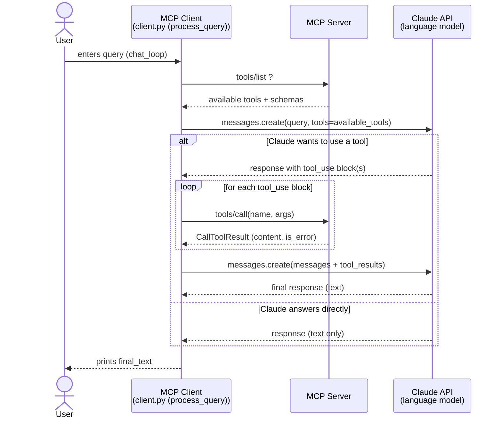

# Demo MCP Client Setup

Mainly following the official tutorial from Anthropic:
[Build an MCP client](https://modelcontextprotocol.io/docs/2026-07-28/develop/build-client)


## ⏩ To simply run this demo without going through the tutorial

```bash
# First clone repo for MCP Server
git clone https://github.com/MMaghnie/mcp-server

# Then clone this MCP Client repo & navigate to it
git clone https://github.com/MMaghnie/mcp-client.git
cd mcp-client

# Create virtual env
uv venv 

# Activate virtual env (on Windows)
.venv\Scripts\activate

# Install dependencies
uv sync 

# Run the MCP Client and the MCP Server
uv run client.py ..\mcp-server\mcp-server.py 
```

You can then ask the LLM about the weather.

### ✅ An example of how a successful run looks like

Here, as an example, the user asked `Are there weather alarms for LA?`:

```bash
(mcp-client) D:\Repos\Playground\MCP\mcp-client>uv run client.py ..\mcp-server\mcp-server.py

Connected to server with tools: ['get_alerts', 'get_forecast']

MCP Client Started!
Type your queries or 'quit' to exit.

Query: Are there weather alarms for LA?

[Calling tool get_alerts with args {'state': 'LA'}]
Yes, there are weather alerts for Louisiana (LA). There are currently **Heat Advisories** in effect:

**Alert 1 - Heat Advisory (Moderate Severity)**
- **Areas affected:** Parts of southeast Arkansas, northeast Louisiana, and central/western Mississippi (including multiple parishes)
- **When:** From 11 AM this morning to 7 PM CDT this evening
- **Heat Index:** Up to 110°F expected
- **Impact:** Hot temperatures and high humidity may cause heat-related illnesses
- **Recommendations:** Stay hydrated, remain in air conditioning, avoid sun exposure, wear lightweight clothing, limit strenuous activities to early morning/evening

**Alert 2 - Heat Advisory (Moderate Severity)**
- **Areas affected:** South central and southwest Arkansas, north central and northwest Louisiana, southeast Oklahoma, and east/northeast Texas
- **When:** From 10 AM to 7 PM CDT Tuesday
- **Heat Index:** Up to 109°F expected
- **Impact:** Hot temperatures and high humidity may cause heat illnesses
- **Recommendations:** Similar precautions as above

Both alerts emphasize the importance of staying cool, hydrating, and checking on relatives and neighbors during this dangerous heat period.

Query: 
```


## ℹ️ Implementation notes for following the tutorial:

These notes are specifically about the [Imports and Setup](https://modelcontextprotocol.io/docs/2026-07-28/develop/build-client#imports-and-setup) step.

### Don't use the most expensive model, as suggested by the tutorial

The tutorial suggests using `claude-opus-5` as the `MODEL`.

But for the purposes of this simple demo, `claude-haiku-4-5-20251001`* uses fewer tokens and performs well enough.

> \* This is the most economic model at the time of writing this readme. For an updated list of models, check the official webpage from Anthropic: https://platform.claude.com/docs/en/models/overview and copy the `API-ID` of the relevant model

### If syncing to a remote repo, confirm `.env` is properly gitignored

The tutorial currently suggests using a command to add `.env` to `.gitignore` which doesn't actually let `.env` be ignored. 

Confirm the file is correctly ignored to protect your LLM API key.

## Good-to-knows:

* The call to `Anthropic()` (Line 15) must happen *after* loading env vars (Line 12), so the LLM API key gets properly populated in the LLM Client SDK.

* Where is the MCP server launched exactly? The server is launched by `stdio_client` (Line 132), using the description built by `server_params` (Line 18).

### Under the hood - usage of JSON-RPC methods 

* Line 132, `async with Client(...) as client:`, is where the initial `server/discover` method gets called, for the MCP client and server to get to know each other.

* Line 133, `await client.list_tools()`, sends the actual `tools/list` request from the MCP client to the MCP server, effectively asking "what tools do you have?".

* Line 71 executes `tools/call` 

## ⚠️ Heads-up about extending this demo:

The code in this demo is intentionally kept simple for training purposes and it's not production-ready. 

**Some** reasons:

* The `server_params` function detects server type simply by a naive file extension check. Anything can be renamed to use any file extension postfix, even malicious files.

* No error handling for server file path.

* Nothing checks what's exactly at the server path before running it.

Read more about best practices for scalability with MCP clients here: [Client Best Practices](https://modelcontextprotocol.io/docs/2026-07-28/develop/clients/client-best-practices)


## How the process works at a glance

